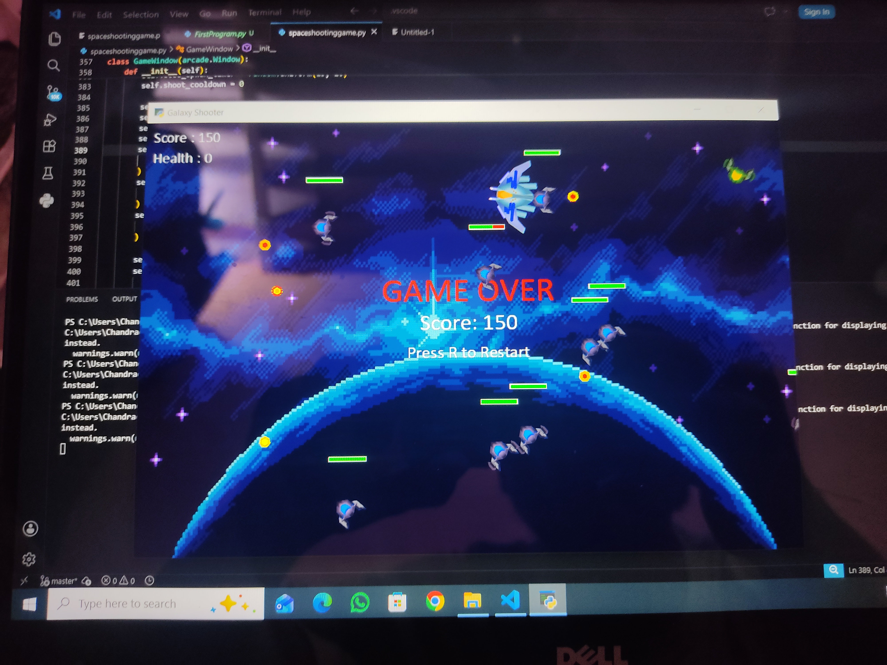

# Galaxy Shooter

A 2D space shooter built in Python, where you dodge and blast your way through waves of enemies and a boss using a mouse-aimed ship.


<!-- swap this with an actual screenshot or gif of your gameplay -->

**[Try it here] :- will upload link once I get my laptop with me again 

## Quick start

```
pip install arcade
python main.py
```

Needs Python 3.11 (Arcade doesn't play nice with newer versions yet, learned that one the hard way).

## What it's got

- WASD movement with mouse-aimed rotation, so your ship actually faces where you're shooting
- Waves of enemies that scale up as you survive longer
- A full boss fight at the end of the run
- Powerups — shield, health, and rapid fire — that drop randomly
- Particle explosions when stuff dies (very satisfying)
- A 15-second invincibility window after taking damage so you're not instantly chain-killed
- Enemy bullets you actually have to dodge, not just static enemies
- Scrolling background and real sprite graphics instead of basic shapes
- Background music + sound effects
- Game Over screen, press R to restart instantly

## How it works

Originally I drew the bullets and ship as raw shapes using Arcade's drawing functions, but switched to sprite images partway through because hitbox detection got way more reliable with actual sprite bounding boxes instead of manually tracking shape coordinates. The bullets specifically use a sprite from the JanaChumi asset pack — small change, but it made collisions feel a lot less janky.

One thing that took longer than expected: Arcade 3.x changed a bunch of its API from older tutorials online (`self.clear()` instead of `arcade.start_render()`, texture rects instead of raw draw calls), so a chunk of the build was just untangling outdated examples to find what actually works now.

## Credits

- Sprites from the **Warped Space Shooter** and **spaceshooter_ByJanaChumi** asset packs
- Built with [Arcade](https://api.arcade.academy/)

## Notes

This was built solo, mostly debugging my way through Arcade's docs at midnight. If you find a bug, no you didn't.
